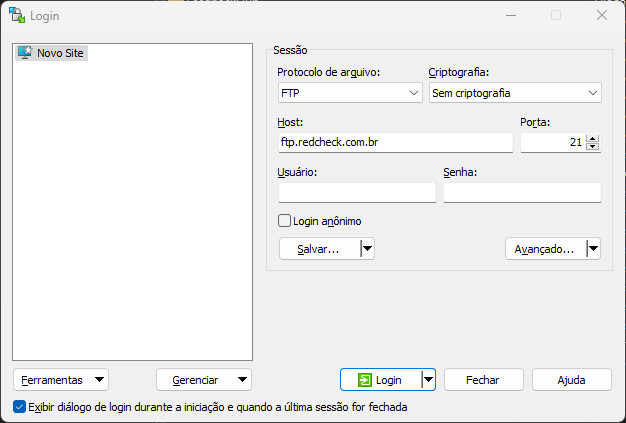

# Sincronização com servidor FTP RedCheck

Para sincronização de pastas em computadores Windows recomendamos o uso do [WinSCP](https://winscp.net/eng/download.php).

## 1. Configuration WinSCP

### Dados do servidor FTP

Configuração do WinSCP:
    - Host: `ftp.redcheck.com.br`
    - Porta: 21
    - Usuário: ...
    - Senha: ...
    - Encriptação: selecionar a opção "Sem criptografia"

Conforme figura abaixo:

### Sincronização automática

1. Verifique os valores da variáveis no script de sincronização [sync_ftp.cmd](./sync_ftp.cmd).
2. Execute o script.

### Executar sincronização da inicialização do sistema

Crie um link para o arquivo [run_sync.vbs](./run_sync.vbs) e coloque-o em `%USERPROFILE%\AppData\Roaming\Microsoft\Windows\Start Menu\Programs\Startup`.

## Eyer (Phelcom)

1. Seleciona a opção "FTP"
2. Preenche os dados de "SERVIDOR FTP DE ENTRADA":
    - Servidor: `ftp.redcheck.com.br`
    - Porta: 21
    - Diretório de entrada: `/`
    - Usuário: ...
    - Senha: ...
3. Em "SERVIDOR FTP DE SAÍDA", marque a opção "IGUAL AO SERVIDOR DE ENTRADA".

> [!WARNING]
> Certifique-se que as configurações do nome do arquivo começam com `/`, que apontem para uma pasta.
> 
> Exemplo: `/`  `Retinografia`  `/`  `pacientes.cpf`. Neste caso, deve-se usar `Retinografia` como pasta dos exames do tipo "Retinografia" nas configurações de mapeamento na plataforma RedCheck.

## Referências

- <https://superuser.com/questions/954950/run-a-script-on-start-up-on-windows-10>
- <https://windowsloop.com/run-powershell-script-on-startup>
