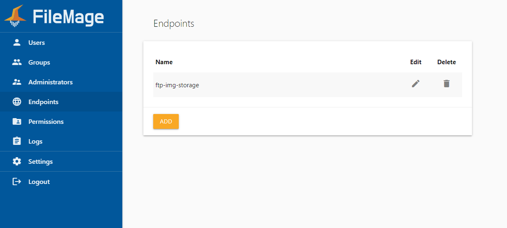
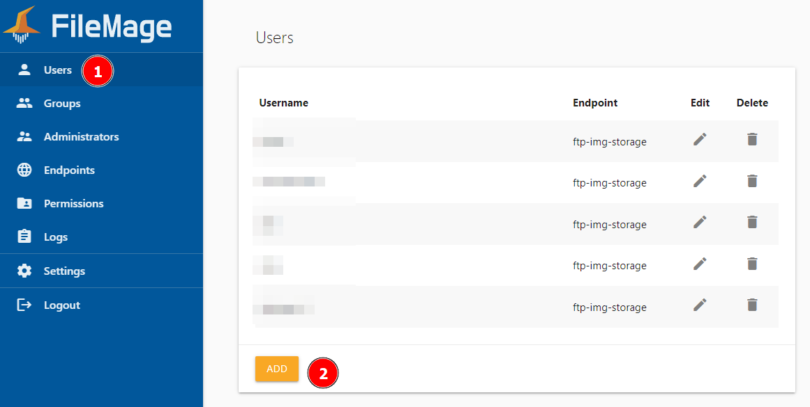
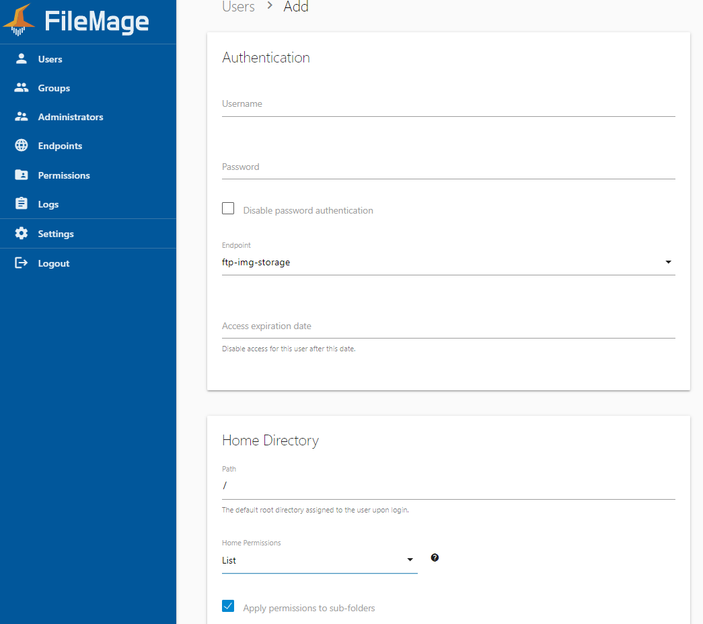

# Servidor FTP

A aplicação responsável pelo servidor é o [FileMage](https://docs.filemage.io). Na RedCheck, o painel de administração pode ser acessado neste [link](https://ec2-44-209-92-64.compute-1.amazonaws.com).

## Adicionando novos usuários

1. Acesse o formulário de cadastro de usuário:
    

2. Preencha o formulário do usuário. Recomendações:
   1. Nome de usuário (username): usar email da clínica;
   2. Senha (password): evite uso de caracteres especiais.
   3. *Home Directory* > *Path*: `/clinicaId=<ID da clínica no banco>`, e selecione *Full* em *Home Permissions*.
 Cerifique-se que o diretório existe no bucket [`ftp-img-storage`](https://s3.console.aws.amazon.com/s3/buckets/ftp-img-storage?region=us-east-1&bucketType=general&tab=objects).
    
